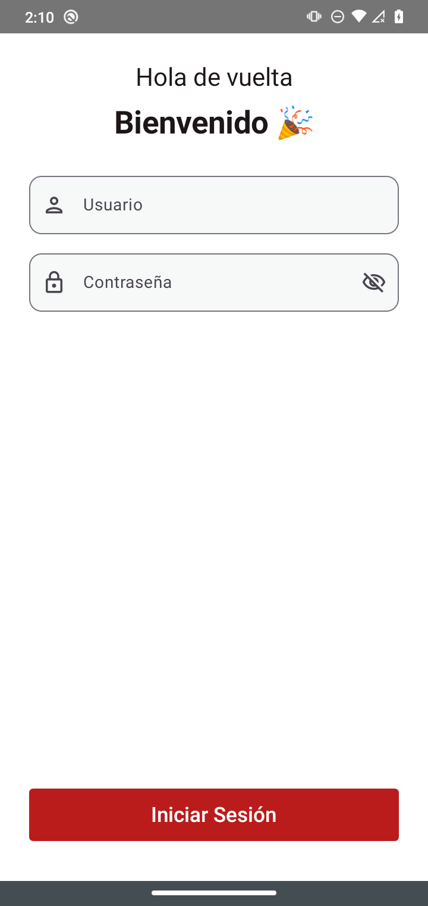

# Cashback App

Aplicación Android desarrollada en **Kotlin** y **Jetpack Compose** para el proceso de **canje de productos mediante cashback**, permitiendo validar tickets, consultar promociones y gestionar el flujo de redención de manera sencilla y rápida.

## ✨ Características

* 📱 Interfaz moderna desarrollada con **Jetpack Compose**.
* 🎟️ Validación de tickets mediante código QR.
* 💰 Consulta de saldo y beneficios de cashback.
* 🎁 Canje de productos disponibles.
* 🔄 Integración con servicios REST para obtener información en tiempo real.
* 📡 Arquitectura basada en MVVM y consumo de APIs.

---

## 📸 Capturas de pantalla

### Pantalla principal



### Historial de pedidos


### Detalle del Cashback


### Canje de productos


### Error de inventario


---

## 🛠️ Tecnologías utilizadas

* Kotlin
* Jetpack Compose
* Material Design 3
* ViewModel
* Coroutines
* Retrofit
* Navigation Compose
* MVVM Architecture

---

## 🚀 Instalación

1. Clona el repositorio:

```bash
git clone https://github.com/maccRevolucion/CashbackApp.git
```

2. Abre el proyecto en Android Studio.

3. Sincroniza las dependencias de Gradle.

4. Ejecuta la aplicación en un dispositivo o emulador con Android.

---

## 📂 Estructura general

```
app/
 ├── ui/
 ├── navigation/
 ├── viewmodel/
 ├── repository/
 ├── data/
 ├── network/
 └── utils/
```

---

## 🔗 Flujo general

1. El usuario escanea un código QR.
2. La aplicación valida el ticket mediante la API.
3. Se obtiene la información del cashback disponible.
4. El usuario consulta los productos disponibles.
5. Se realiza el canje y se registra la operación.

---

## 📄 Licencia

Este proyecto se desarrolló con fines de implementación y demostración del flujo de cashback y canje de productos.
